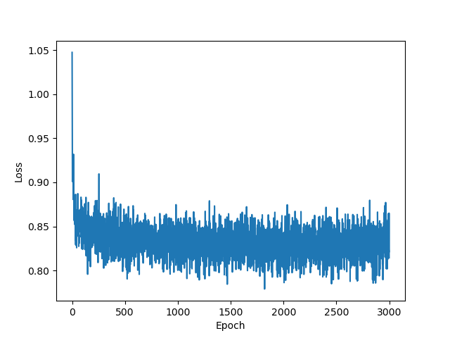
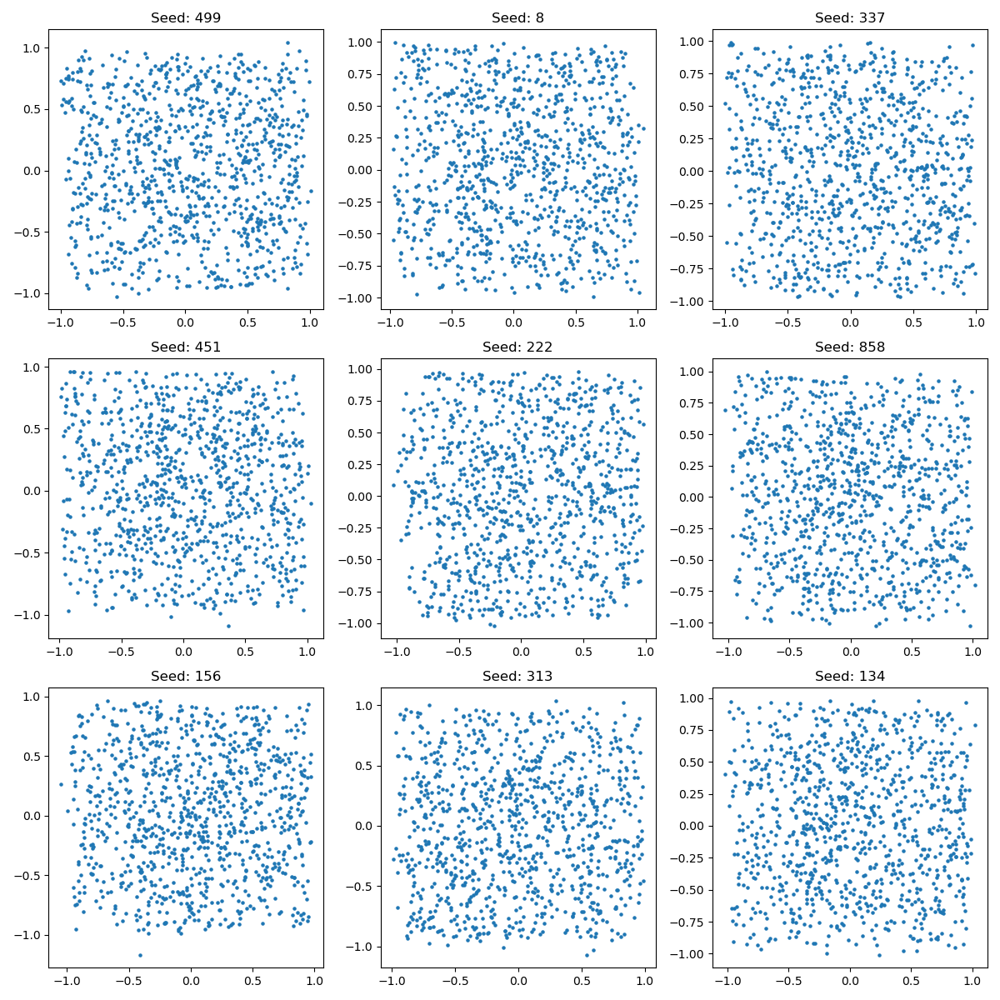
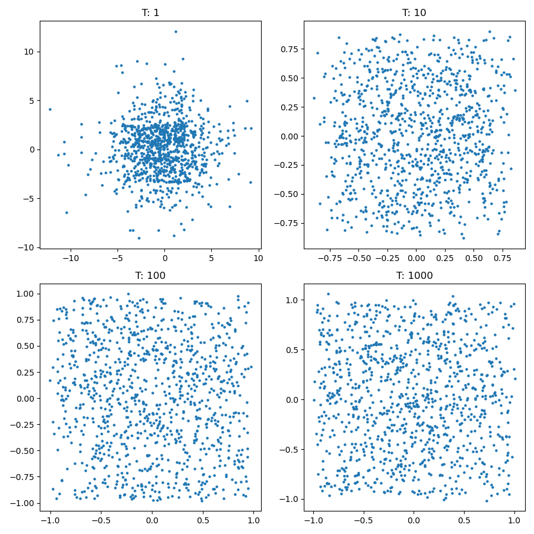
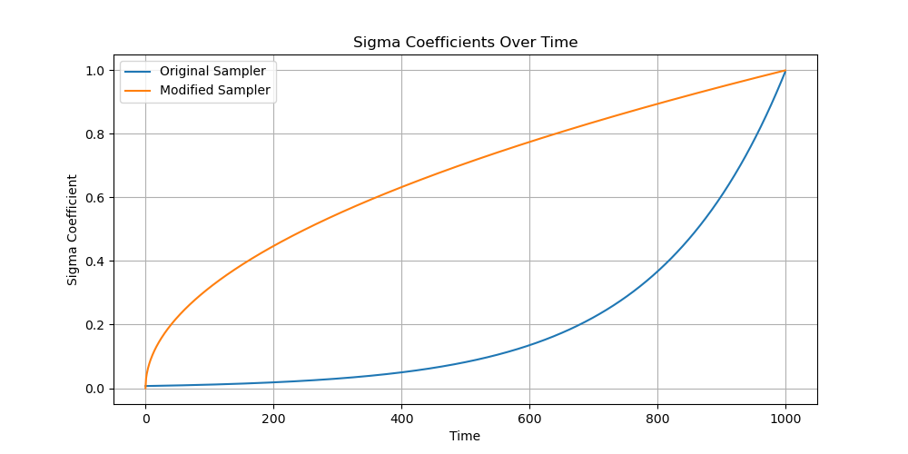
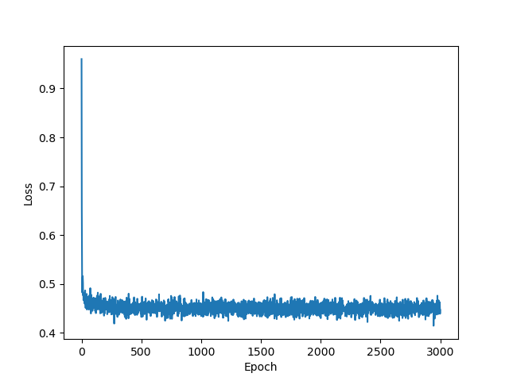
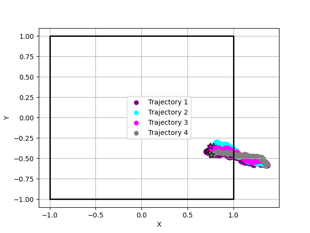
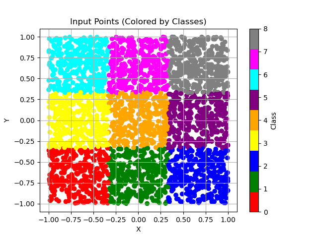
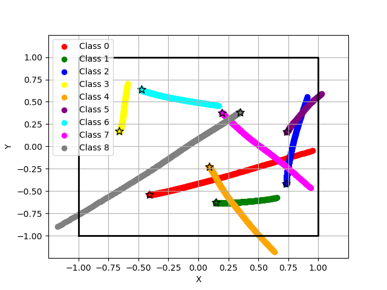
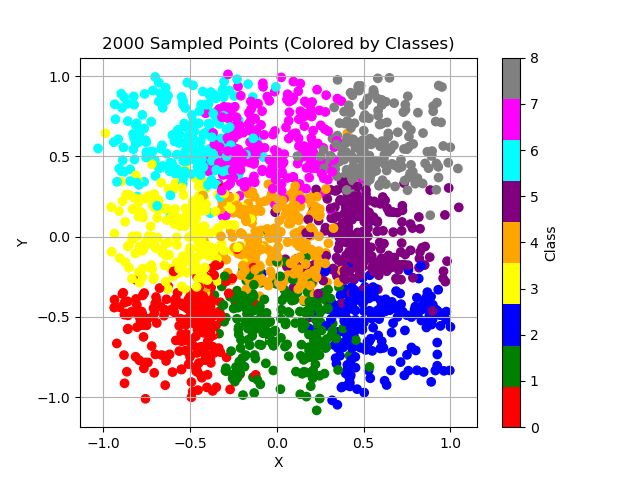

# Diffusion Model Exercise

In this exercise, we will be training a diffusion model over 2D points. The diffusion model consists of a forward process and a reverse process. The forward process gradually converts inputs from their natural population distribution to a Gaussian distribution, while the reverse process aims to denoise the Gaussian samples and reconstruct the original inputs.

## Forward Process
The forward process is formulated as a Stochastic Differential Equation (SDE). In each time step, the input is shrunk and Gaussian noise is added to it. The forward process step can be represented by the equation:

xt+dt = xt &middot; (1 - f(t) &middot; dt) + g(t) &middot; dW

The forward process can be performed all at once using the marginal time and noise schedules:

xt = N(S(t) · x0, S^2(t) · σ^2(t) · I)

Assuming a Variance Exploding (VE) process, the equation simplifies to:

x_t = x_0 + σ^2(t) · ϵ

## Reverse Process - Training
The reverse process involves training a denoiser to reconstruct the original inputs from the Gaussian samples. The denoiser is conditional on the timestep and predicts the added noise. The denoised point can be obtained using the equation:

x_hat0 = xt - σ(t) · D(xt, t)

During training, the objective is to minimize the mean squared error between the denoised point and the predicted noise.

## Reverse Process - DDIM Sampling
Sampling in the reverse process is defined in terms of the marginal scale and noise functions. The sampling step can be represented by the equation:

dx = [S'(t)/S(t)x - S^2(t)σ'(t)/σ(t) ∇xlog(p(x, t))]dt

In a VE process, the equation simplifies to:

dx = −σ˙(t)σ(t) · ∇xlog(p(x, t)) · dt

The sampling process involves iteratively updating the sample using the reverse process equation and the denoiser predictions.

## Exercise Overview
In this exercise, we will train a diffusion model on 2D points. The main tasks and assignments include:

1. Training an unconditional diffusion model on 2D points.
2. Visualizing the forward process trajectory of a point in a 2D space.
3. Plotting the loss function over the training batches of the denoiser.
4. Generating multiple samplings of points using different seeds.
5. Analyzing the effects of the number of sampling steps on the results.
6. Modifying the sampling schedule and plotting the σ coefficients over time.
7. Examining the outputs of the reverse sampling process with multiple input noises.
8. Training a conditional diffusion model by incorporating class information.
9. Visualizing the input points colored by their classes.
10. Sampling points from each class and validating their trajectories.
11. Sampling points from the trained conditional model and analyzing the results.
12. Estimating the probability of selected points and comparing with the input distribution.

## Implementation Details
The exercise allows freedom in choosing the implementation details. However, the following recommendations are provided:

- Architecture: Use a simple network with 2-3 fully-connected layers and LeakyReLU activation.
- Optimizer: Adam with a learning rate of 1e-3.
- Number of Sampling Steps (T): Set to 1000 (dt = 1./T).
- Noise Scheduler: σ(t) = e^5(t−1).
- Batch Size: Use all samples for performing gradient descent (GD).
- Number of Epochs: Set to 3000.

The exercise should be implemented using the following libraries: numpy, pytorch, matplotlib, tensorboard, wandb, pandas, and plotly (optional).

Please refer to the exercise prompt for more specific instructions and tasks for both the unconditional and conditional diffusion models.

That's the description of the exercise. Let me know if you need any further assistance!

## Results from Unconditional Model
The following are the results from the exercise:

- Plot of the loss function over the training batches of the denoiser:

- Generation of multiple samplings of points using different seeds:

- Analysis of the effects of the number of sampling steps on the results:

- Plotting of the σ coefficients over time for different sampling schedules:

- The loss function over the training batches of the denoiser, using the new scheduler:

- Denoising Trajectories of 4 sampled points, achieved using a modified denoiser with same initial noise:

## Results from Conditional Model
The following are the results from the exercise:
- Visualization of the input points colored by their classes:

- Sampling of points from each class and validation of their trajectories:

- Sampling of points from the trained conditional model and analysis of the results:

